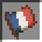

# French Mode

**Description:** Turn everyone into a Frenchman

Every online players will be gived a French flag and a baguette.

- A baguette is a reskin of the wooden sword
- The French Flag is a simple retexture of a paper, and the flag is useless

The plugin will also be in french only

