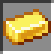

# Midas Touch

**Description:** Everything you touch turns into gold

# Minecraft Item to Gold Conversions

You will turn every things you can to ore

# Entity
After a hit, entity will became gold (not visualy but they will be stunned) and player will die with message `{player} was turned into gold`

# Items 
Armor piece → Gold armor piece
Deepslate ore → Deepslate gold ore
...

Arrow → Spectral Arrow
Rail → Powered Rail
Melon Slice → Glistering Melon Slice
Carrot → Golden Carrot
Apple → Golden Apple

Any other item → Gold Ingot